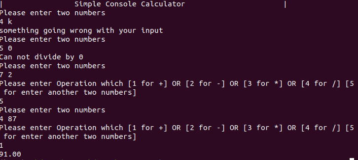

# simple-console-calculator-
simple console calculator

This simple c++ program that let you enter two numbers and make simple operations like +,-,*,/.

### run on terminal: ./c++_console_calculator

Screanshot output

