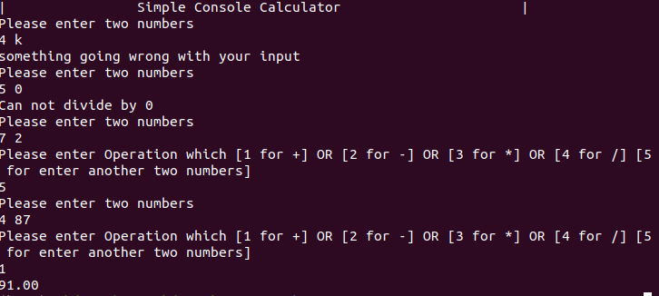
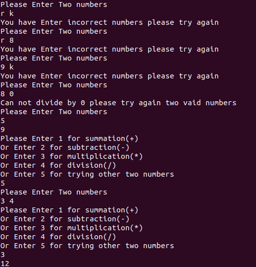

# simple-console-calculator-
simple console calculator

This simple c++ program that let you enter two numbers and make simple operations like +,-,*,/.

Another implementation using functions and clean code
### run on terminal: ./c++_console_calculator

### run on terminal: ./calculator_using_function
Screanshots output

